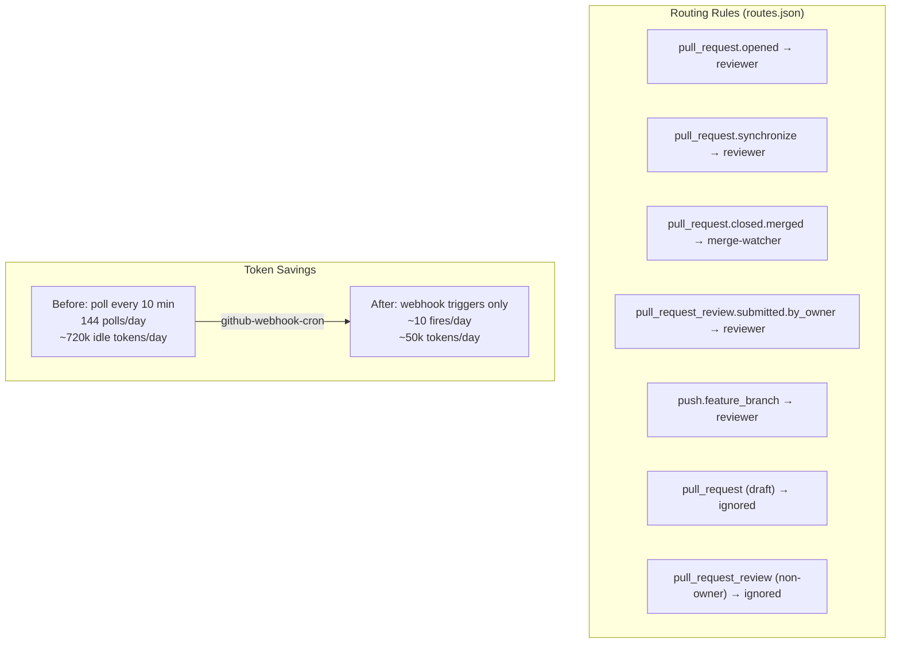

# github-webhook-cron — Event-Driven Wakes for [cron-framework](https://github.com/Agent-Crafting-Table/cron-framework)

Route GitHub webhook events to cron-framework triggers. Replaces "poll every 10 minutes hoping there's something to do" with "wake up exactly when GitHub tells us to."

> Part of [The Agent Crafting Table](https://github.com/Agent-Crafting-Table) — standalone agent system components for Claude Code.

## How It Works

```mermaid
sequenceDiagram
    participant GH as GitHub
    participant WS as webhook-server.js
(PORT 7456)
    participant WH as webhook-handler.js
    participant TF as crons/triggers/
    participant CR as cron-runner
(60s tick)
    participant AG as Claude Agent

    GH->>WS: POST /webhook
(pull_request, push, review...)
    WS->>WS: Buffer request body
    WS->>WH: Pipe payload via stdin
    WH->>WH: Verify HMAC SHA-256
signature
    alt invalid signature
        WH-->>WS: exit 1
        WS-->>GH: 403
    else valid
        WH->>WH: Look up routing rule
in crons/routes.json
        alt no rule match
            WH-->>GH: 200 {"action":"ignored"}
        else rule matched
            WH->>TF: write crons/triggers/reviewer.trigger
            WH-->>GH: 200 {"action":"triggered"}
            CR->>TF: detect trigger file on next 60s tick
            CR->>AG: spawn Claude agent for job
            AG->>TF: delete trigger file
        end
    end
```



## What This Solves

Cron agents that watch GitHub (PR reviewers, merge watchers, CI fixers) typically poll on a fixed schedule. ~80% of those polls find nothing to do — they spin a Claude session, list open PRs, see no new state, and exit. On a Max plan that's hundreds of empty token spins per day.

This repo flips it. GitHub fires a webhook on PR open / sync / review / close / push. The handler drops a trigger file at `crons/triggers/<jobId>.trigger`. The cron-runner picks it up on its next 60s tick and fires the agent **only when there's actually something to look at**. Empty polls go to zero.

## Setup

### 1. Drop into your project

```bash
git clone https://github.com/Agent-Crafting-Table/github-webhook-cron.git lib/github-webhooks
```

Or copy `src/` into your existing repo. No npm install needed — pure node, no deps.

### 2. Create your routing config

Copy `examples/routes.json` to `crons/routes.json` and edit:

```json
{
  "owner_logins": ["yourname"],
  "feature_branch_regex": "^refs/heads/feat/",
  "rules": {
    "pull_request.opened":             "reviewer",
    "pull_request.ready_for_review":   "reviewer",
    "pull_request.synchronize":        "reviewer",
    "pull_request.reopened":           "reviewer",
    "pull_request.closed.merged":      "merge-watcher",
    "pull_request_review.submitted.by_owner": "reviewer",
    "push.feature_branch":             "reviewer"
  }
}
```

The values (`"reviewer"`, `"merge-watcher"`) are the cron job IDs you want to wake. The handler writes `crons/triggers/<value>.trigger` and your cron-runner picks it up.

- **`owner_logins`** — pull_request_review events from these users trigger the `.by_owner` rule. Reviews from anyone else (including bot reviewers you produce yourself) are ignored.
- **`feature_branch_regex`** — push events whose ref matches this regex trigger the `push.feature_branch` rule. Pushes to other refs are ignored.
- **`rules`** — keys are dotted event paths. Missing keys → that event is ignored (no error).

### 3. Configure the secret

Pick a random hex string. Set it on **both** the GitHub webhook ("Secret" field) and your environment:

```bash
export GITHUB_WEBHOOK_SECRET=$(openssl rand -hex 32)
```

The handler verifies HMAC SHA-256 via `X-Hub-Signature-256`. Without a secret, anyone can hit your endpoint and trigger your agents — never run in production without one.

### 4. Run the server

```bash
PORT=7456 \
ROUTES_FILE=./crons/routes.json \
WORKSPACE_DIR=$(pwd) \
node src/webhook-server.js
```

### 5. Expose it to GitHub

GitHub needs a public URL. Three options:

1. **Cloudflare Tunnel** — `cloudflared tunnel run --url http://localhost:7456`
2. **Reverse proxy** behind nginx / caddy with TLS
3. **ngrok** for local dev — `ngrok http 7456`

### 6. Configure the GitHub webhook

In your repo → Settings → Webhooks → Add webhook:

- **Payload URL**: `https://your-public-url/webhook`
- **Content type**: `application/json`
- **Secret**: the value of `GITHUB_WEBHOOK_SECRET`
- **Events**: select Pull requests, Pull request reviews, and Pushes

## Routing Rules

| Event | Condition | Rule key | Default trigger |
|---|---|---|---|
| `ping` | always | (built-in) | ignored |
| `pull_request` | `action=opened/ready_for_review/synchronize/reopened`, not draft | `pull_request.<action>` | (per rule) |
| `pull_request` | `action=closed`, `merged=true` | `pull_request.closed.merged` | (per rule) |
| `pull_request` | `action=closed`, `merged=false` | (built-in) | ignored |
| `pull_request` | draft | (built-in) | ignored |
| `pull_request_review` | `action=submitted`, sender ∈ `owner_logins` | `pull_request_review.submitted.by_owner` | (per rule) |
| `pull_request_review` | sender not in `owner_logins` | (built-in) | ignored |
| `push` | ref matches `feature_branch_regex` | `push.feature_branch` | (per rule) |
| `push` | ref does not match | (built-in) | ignored |
| anything else | always | (no rule) | ignored |

## CLI / Testing

```bash
cat payload.json | node src/webhook-handler.js \
  --event pull_request \
  --routes ./crons/routes.json \
  --dry-run

# {"action":"dry-run","reason":"pr.opened #12","trigger":"reviewer"}
```

## Tests

```bash
node test/webhook-handler.test.js
```

15 cases — covers every routing branch, signature verification, and the trigger-file write path.

## Safety Notes

- **Always set `GITHUB_WEBHOOK_SECRET`** in production. Without it the handler will accept any payload.
- The trigger files are empty — no risk of payload smuggling.
- The handler runs `JSON.parse` + small string operations; no shell-out, no eval.
- The server has no TLS — terminate TLS at your reverse proxy / tunnel.

## Token-Savings Math

Rough estimate from running this on a 5-agent fleet:

| Before (10-min poll) | After (webhook) |
|---|---|
| 144 polls/day | ~10 webhook fires/day |
| 144 Claude spins | 10 Claude spins |
| ~720k tokens/day idle reading | ~50k tokens/day idle reading |

## License

Apache-2.0
